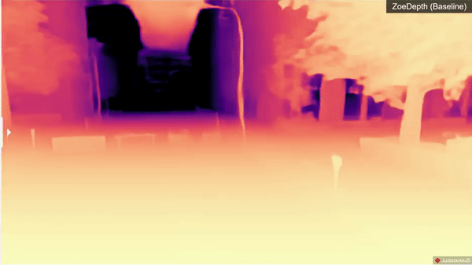

<div align="center">
<h1>PatchFusion </h1>
<h3>An End-to-End Tile-Based Framework <br> for High-Resolution Monocular Metric Depth Estimation</h3>

<a href="https://zhyever.github.io/patchfusion/">[Project Website] </a> | <a href="">[Arxiv Paper] </a>
<br><a href="https://zhyever.github.io/">Zhenyu Li</a>, <a href="https://shariqfarooq123.github.io/">Shariq Farooq Bhat</a>, <a href="https://peterwonka.net/">Peter Wonka</a>. 
<br>KAUST

<center>

</center>

</div>

## **Environment setup**
The project depends on :
- [pytorch](https://pytorch.org/) (Main framework)
- [timm](https://timm.fast.ai/)  (Backbone helper for MiDaS)
- [ZoeDepth](https://github.com/isl-org/ZoeDepth) (Main baseline)
- pillow, matplotlib, scipy, h5py, opencv (utilities)

Install environment using `environment.yml` : 

Using [mamba](https://github.com/mamba-org/mamba) (fastest):
```bash
mamba env create -n patchfusion --file environment.yml
mamba activate patchfusion
```
Using conda : 

```bash
conda env create -n patchfusion --file environment.yml
conda activate patchfusion
```

## **Pre-Train Model**
Download our pre-train model [here](https://drive.google.com/file/d/13M_qLOVSANDT1ss59Iebzjj3d0ZeVCi4/view?usp=sharing). Put this checkpoint at ``nfs/patchfusion_u4k.pt`` as preparation for the following steps.

## **Gradio Demo**
We provide a UI demo built using [gradio](https://gradio.app/). To get started, install UI requirements:
```bash
pip install -r ui_requirements.txt
```
Then launch the gradio UI for depth estimation or image to 3D:
```bash
python ./ui_prediction.py --model zoedepth_custom --ckp_path nfs/patchfusion_u4k.pt --model_cfg_path ./zoedepth/models/zoedepth_custom/configs/config_zoedepth_patchfusion.json
```

Then launch the gradio UI for depth-guided image generation with ControlNet (You might need to install ControlNet dependency as well. Please check ``ControlNet/environment.yaml`` and [official guidance](https://github.com/lllyasviel/ControlNet/tree/main)):
```bash
python ./ui_generative.py --model zoedepth_custom --ckp_path nfs/patchfusion_u4k.pt --model_cfg_path ./zoedepth/models/zoedepth_custom/configs/config_zoedepth_patchfusion.json
```

## **User Inference**

1. Put your images in folder ``path/to/your/folder``

2. Run codes:
    ```bash
    python ./infer_user.py --model zoedepth_custom --ckp_path nfs/patchfusion_u4k.pt --model_cfg_path ./zoedepth/models/zoedepth_custom/configs/config_zoedepth_patchfusion.json --rgb_dir path/to/your/folder --show --show_path path/to/show --save --save_path path/to/save --mode r128 --boundary 0 --blur_mask
    ```

3. Check visualization results in ``path/to/show`` and depth results in ``path/to/save``, respectively.

**Args**
- We recommand users to use ``--blur_mask`` to reduce patch artifacts, though we didn't use it in our standard evaluation process.
- ``--mode``: select from p16, p49, and r**n**, where **n** is the number of random added patches.
- Please refer to ``infer_user.py`` for more details.

## Citation
If you find our work useful for your research, please consider citing the paper
```
@article{
    li2023patchfusion,
    title={PatchFusion: An End-to-End Tile-Based Framework for High-Resolution Monocular Metric Depth Estimation}, 
    author={Zhenyu Li and Shariq Farooq Bhat and Peter Wonka},
    year={2023},
    eprint={2312.02284},
    archivePrefix={arXiv},
    primaryClass={cs.CV}
}
```