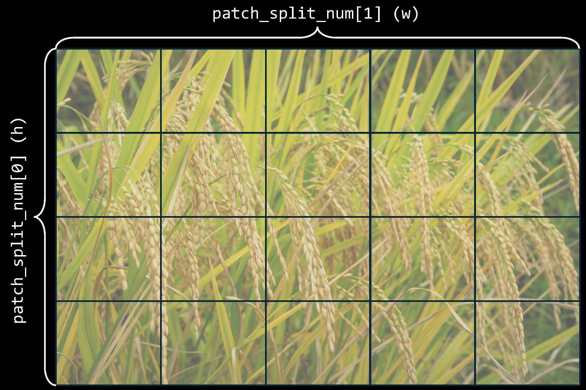
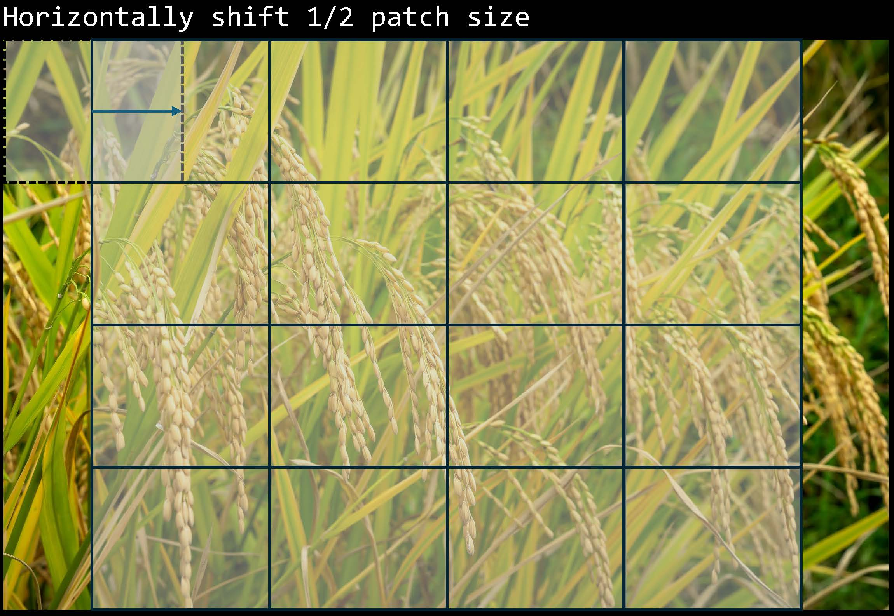
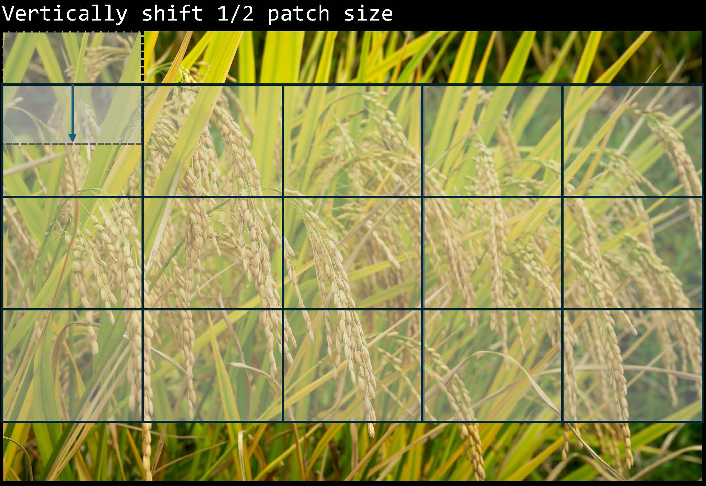

# **User Inference**

## PatchFusion Mode:

In the PatchFusion framework, we initially introduced the modes `p16`, `p49`, and `rn`, specifically designed for processing 4K input images. Here, we have expanded our approach to include `m1`, `m2`, and `rn` modes. These enhancements introduce greater flexibility, allowing for customized inference tailored to various image resolutions and requirements.

To facilitate this, we've introduced three additional parameters for the tiling strategy:

- `image_raw_shape`: Specifies the original dimensions of the input image. For instance, setting `image_raw_shape=[2160, 3840]` configures the system to process a standard 4K input image.

- `patch_split_num`: Defines how the input image is divided into smaller patches for processing. The `setting patch_split_num=[4, 5]` indicates that the image will be split into 4 patches vertically (height dimension) and 5 patches horizontally (width dimension). An illustrative example of this tiling strategy is depicted in Figure 1.

- `process_num`: Determines the batch size for processing patches during inference, balancing inference speed against GPU memory usage.

- **Note**: It's required `image_raw_shape[0]%(2*patch_split_num[0])==0` and `image_raw_shape[1]%(2*patch_split_num[1])==1`, which means image height and width should be divisible by `2*patch_split_num[0]` and `2*patch_split_num[1]`, respectively.

These parameters provide users with the ability to customize the inference process according to the specific characteristics of their input data, optimizing the performance and accuracy of PatchFusion's depth estimation capabilities.

The different modes are introduced as follow.

- `m1`. This mode divides the image into `patch_split_num[0] x patch_split_num[1]` non-overlapping patches, covering the entire image.


*Figure 1: Illustration of mode `m1`.*

<p align="center">
  
  
  
</p>

- `m2`. In this mode, we add shifted patches (horizontally and vertically) based on `m1`. 

*Figure 2: Illustration of mode `m2`.*

- `rn`. `n` patches will be processed based on `m2`.

## Simple Forward Instruction:

Here is the copy of [**Easy Way to Import PatchFusion**](https://github.com/zhyever/PatchFusion?tab=readme-ov-file#easy-way-to-import-patchfusion) in [README.md](../README.md). Now, we're extending it to support customized tiling strategy.

```python
import cv2
import torch
import numpy as np
import torch.nn.functional as F
from torchvision import transforms

from estimator.models.patchfusion import PatchFusion

model_name = 'Zhyever/patchfusion_depth_anything_vitl14'

DEVICE = 'cuda' if torch.cuda.is_available() else 'cpu'
model = PatchFusion.from_pretrained(model_name).to(DEVICE).eval()
image_raw_shape = model.tile_cfg['image_raw_shape']
image_resizer = model.resizer

image = cv2.imread('./examples/example_1.jpeg')
image = cv2.cvtColor(image, cv2.COLOR_BGR2RGB) / 255.0
image = transforms.ToTensor()(np.asarray(image)) # raw image

image_lr = image_resizer(image.unsqueeze(dim=0)).float().to(DEVICE)
image_hr = F.interpolate(image.unsqueeze(dim=0), image_raw_shape, mode='bicubic', align_corners=True).float().to(DEVICE)

mode = 'r128' # inference mode
process_num = 4 # batch process size
depth_prediction, _ = model(mode='infer', cai_mode=mode, process_num=process_num, image_lr=image_lr, image_hr=image_hr)
depth_prediction = F.interpolate(depth_prediction, image.shape[-2:])[0, 0].detach().cpu().numpy() # depth shape would be (h, w), similar to the input image
```

As you can see, we use the `r128` mode and `process_num=4` here. To change the tiling strategy, we need to edit the `image_raw_shape` and `patch_split_num`, and then pass them to the model. Here is the modified version. Please notice lines with comments.

```python
import cv2
import torch
import numpy as np
import torch.nn.functional as F
from torchvision import transforms

from estimator.models.patchfusion import PatchFusion

model_name = 'Zhyever/patchfusion_depth_anything_vitl14'

DEVICE = 'cuda' if torch.cuda.is_available() else 'cpu'
model = PatchFusion.from_pretrained(model_name).to(DEVICE).eval()
image_raw_shape = [1080, 1920] # use a customized value instead of default one in model.tile_cfg['image_raw_shape']
image_resizer = model.resizer

image = cv2.imread('./examples/example_1.jpeg')
image = cv2.cvtColor(image, cv2.COLOR_BGR2RGB) / 255.0
image = transforms.ToTensor()(np.asarray(image))

image_lr = image_resizer(image.unsqueeze(dim=0)).float().to(DEVICE)
image_hr = F.interpolate(image.unsqueeze(dim=0), image_raw_shape, mode='bicubic', align_corners=True).float().to(DEVICE)

mode = 'r32' # use fewer patches
process_num = 4

# specify the tiling strategy here
tile_cfg = dict()
tile_cfg['image_raw_shape'] = image_raw_shape
tile_cfg['patch_split_num'] = [2, 2] # use a customized value instead of the default [4, 4] for 4K images

# depth_prediction, _ = model(mode='infer', cai_mode=mode, process_num=process_num, image_lr=image_lr, image_hr=image_hr)
depth_prediction, _ = model(mode='infer', cai_mode=mode, process_num=process_num, image_lr=image_lr, image_hr=image_hr, tile_cfg=tile_cfg) # remember to pass tile_cfg to the model
depth_prediction = F.interpolate(depth_prediction, image.shape[-2:])[0, 0].detach().cpu().numpy()
```

Now, this version works for 2K images and the tiling strategy changes to `2x2` splitting.


## Inference with Multiple GPUs:

Based on the [**Running**](https://github.com/zhyever/PatchFusion?tab=readme-ov-file#running) in [README.md](../README.md), we're extending it to support multiple-gpu inference.

From the basic single-gpu inference:
```bash
python run.py ${CONFIG_FILE} --ckp-path <checkpoints> --cai-mode <m1 | m2 | rn> --cfg-option general_dataloader.dataset.rgb_image_dir='' [--save] --work-dir <output-path> --test-type general [--gray-scale] --image-raw-shape [h w] --patch-split-num [h, w]
```

We extend it to this multiple-gpu version:
```bash
sh tools/dist_test.sh ${CONFIG_FILE} ${GPU_NUM} [arguments]
```

Here is one example for using 4 gpus during the inference, corresponding to the [**example**](https://github.com/zhyever/PatchFusion?tab=readme-ov-file#example-usage) in [README.md](../README.md):
```bash
sh tools/dist_test.sh configs/patchfusion_depthanything/depthanything_general.py 4 --ckp-path Zhyever/patchfusion_depth_anything_vitl14 --cai-mode r32 --cfg-option general_dataloader.dataset.rgb_image_dir='./examples/' --save --work-dir ./work_dir/predictions --test-type general --image-raw-shape 1080 1920 --patch-split-num 2 2
```
